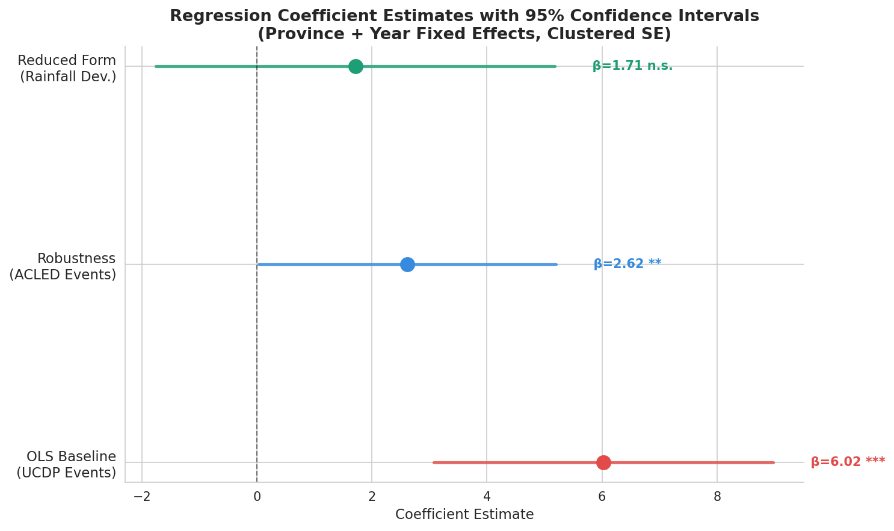
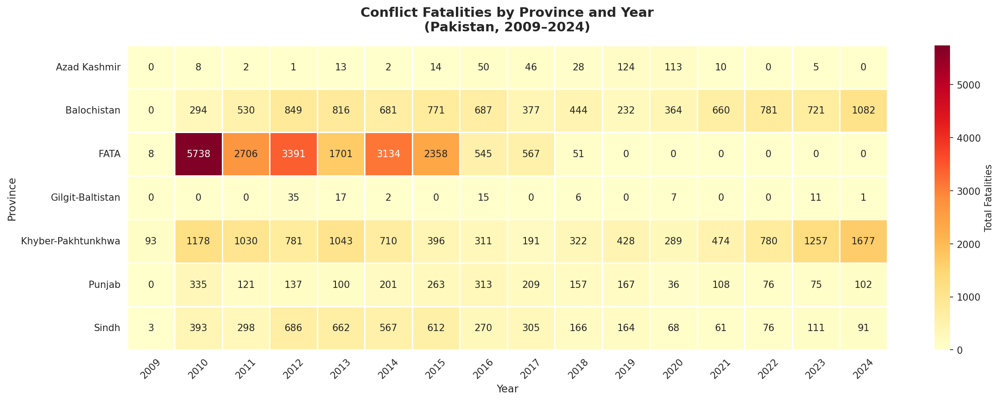

# 🇵🇰📊 Climate, Conflict, and Casualties
### A Provincial Instrumental Variables Analysis of Violence in Pakistan

**Muhammad Shahryar** | Knox College, Department of Economics | Class of 2026
Advisor: Professor Moheb Zidan | ECON 399 Senior Thesis

---

## 📌 Overview
This paper estimates the effect of armed conflict intensity on civilian fatalities across Pakistani provinces (2009–2024), using rainfall shocks as an instrumental variable for conflict — one of the first sub-national econometric analyses of the conflict-fatality nexus in Pakistan.

---

## 📊 Data
| Source | Role | Coverage |
|--------|------|----------|
| UCDP GED v25.1 | Treatment — conflict events | 7,567 events, 43,519 deaths |
| ACLED | Outcome — civilian fatalities | 8,443 events, 47,291 deaths |
| CHIRPS | Instrument — rainfall deviation | 0.05° resolution, 1981–2026 |
| PBS Agricultural Census | Crop intensity (time-invariant) | 1981–82 to 2008–09 |

---

## ⚙️ Methods
- Two-way fixed effects OLS with province and year FE
- Clustered standard errors at province level
- Rainfall IV following Miguel et al. (2004) + Panza & Swee (2023) crop intensity interaction
- Panel: 8 provinces × 16 years, N = 112

---

## 🔑 Key Findings
- **β = 6.02–7.40** additional fatalities per conflict event (p < 0.001) — stable across all specifications
- Within-R² rises from 0.44 → 0.79 with controls
- Rainfall IV: first-stage F = 0.836–7.864 — below threshold; diagnosed as province-level aggregation problem
- Robustness check (ACLED events as treatment): β = 2.62, p < 0.05 ✓

---

## 🗺️ Key Visualizations

### Regression Coefficient Estimates

### Conflict Fatalities by Province and Year

### Conflict Trends — FATA, KPK, Balochistan (2009–2024)

---

## 📎 Citation
Shahryar, M. (2026). *Climate, Conflict, and Casualties: A Provincial Instrumental Variables Analysis of Violence in Pakistan.* Undergraduate thesis, Knox College.

---

## 🛠️ Tools
Python · Pandas · GeoPandas · Matplotlib · Statsmodels · Google Colab · LaTeX
